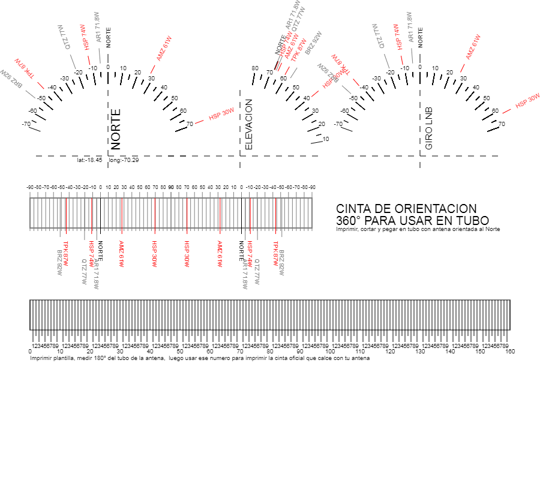

# dishpointer
Apuntador Satelital grafico de orbita GeoEstacionaria

Como dato de entrada se le da la Latitud y Longitud de la antena receptora, y como resultado se obtiene un mapa o dashboard de apuntamiento para el set de satelites Geoestacionarios del listado entregado.

Ademas se genera una Cinta Plantilla imprimible para el tubo vertical de la antena satelital, el cual se usa para medir la vuelta o media vuelta los 180°, se cuentan las rayas, este numero se ingresa en el formulario y como resultado se genera la Cinta imprimible para apuntamiento perfecto de todos el set de satelites ingresados, facilitando mucho el trabajo.

